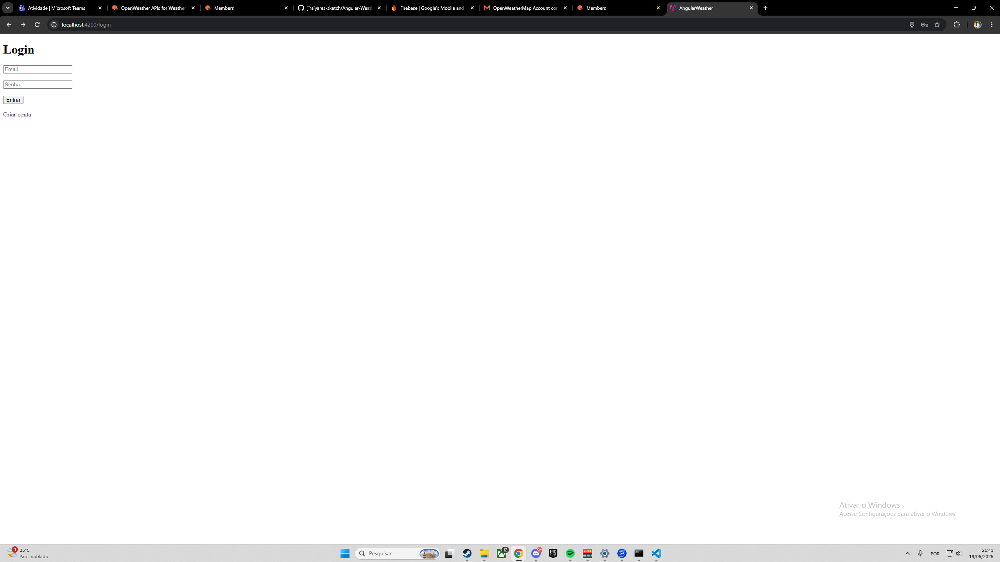
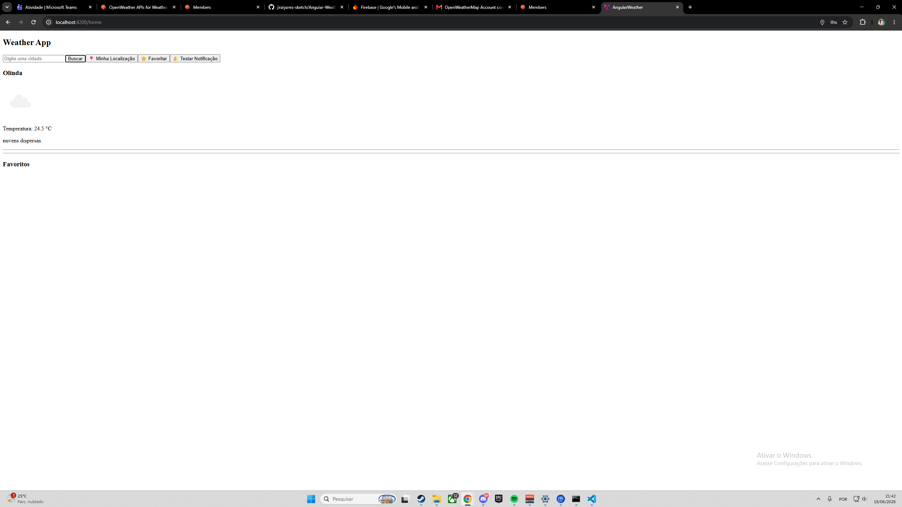
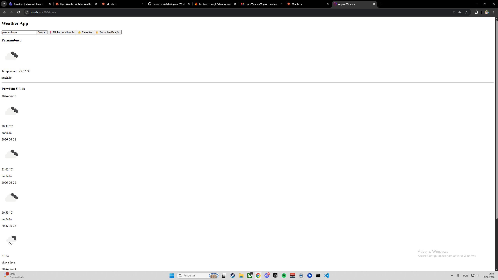

# AngularWeather

Aplicação Angular para consulta meteorológica utilizando a API OpenWeather.

## Tecnologias

- Angular
- TypeScript
- OpenWeather API
- LocalStorage
- HTML/CSS

## Funcionalidades

- Login
- Cadastro
- Busca por cidade
- Geolocalização GPS
- Previsão de 5 dias
- Favoritos
- Notificações climáticas
- Cache Offline

## Como executar

npm install

ng serve

Acesse:

http://localhost:4200

## Imagens

